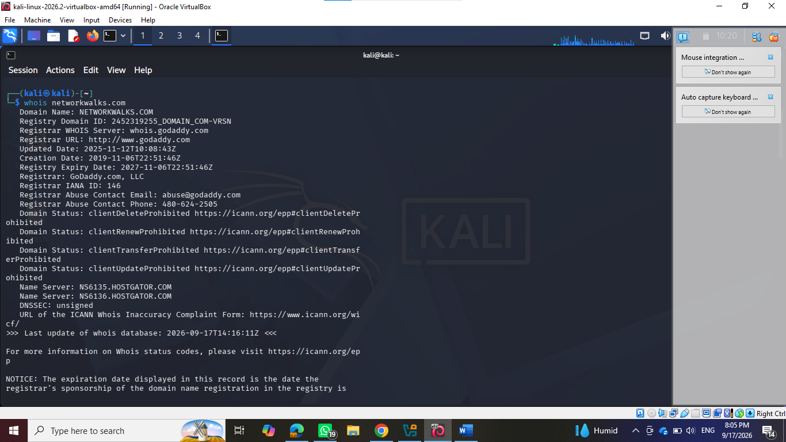
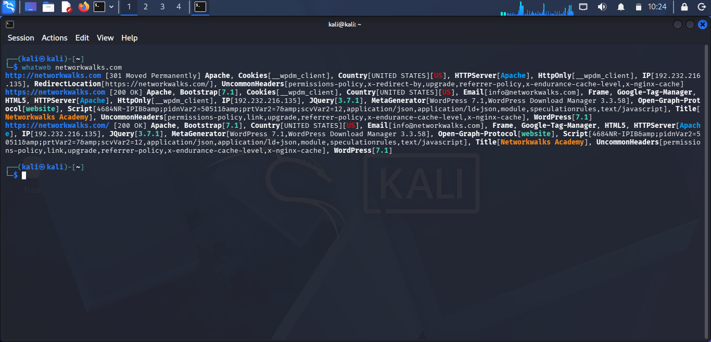
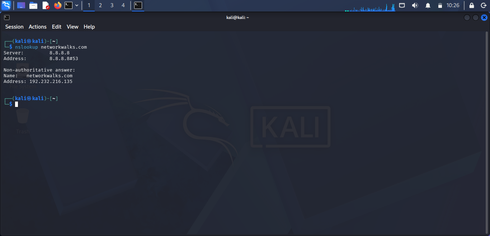
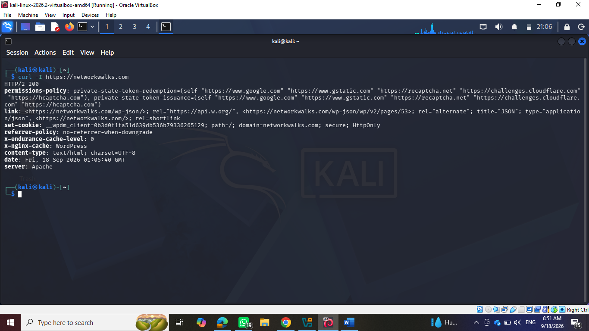
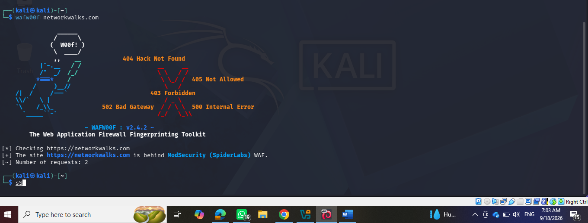
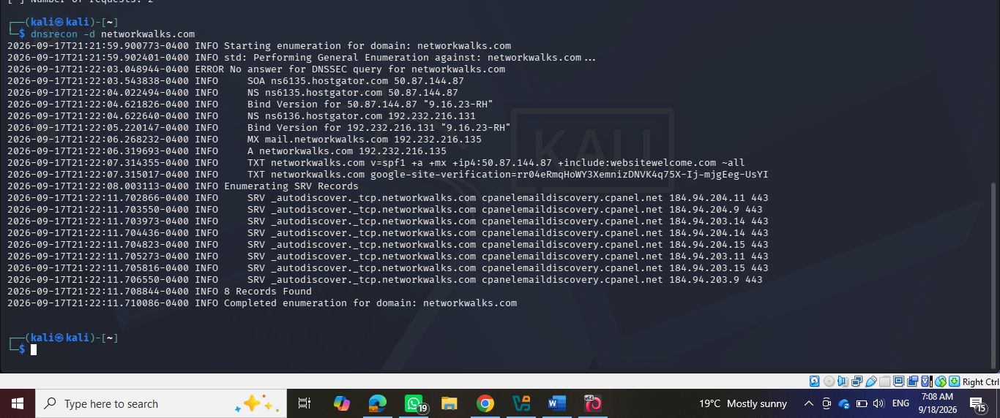
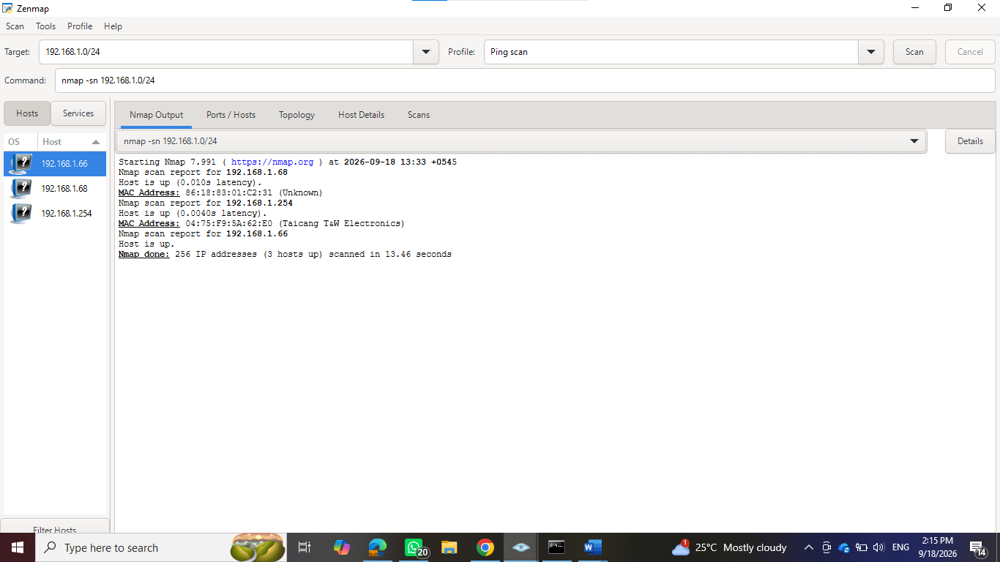
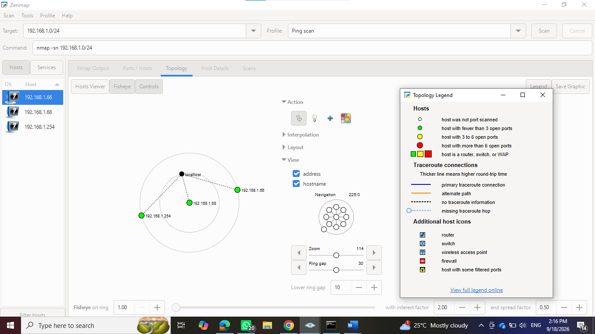

# 🔎 Project Overview

This project focuses on performing **footprinting, reconnaissance, information gathering, DNS enumeration, web technology identification, and network scanning** using Kali Linux.

The purpose of this project is to understand how cybersecurity professionals gather publicly available information about a target and analyze network and web-related information during the reconnaissance phase of an authorized security assessment.

The activities were performed in a controlled cybersecurity learning environment as part of Week 2 of the Cybersecurity & Ethical Hacking internship.


## 🎯 Objectives

The main objectives of this project are to:

* Understand the concept of footprinting and reconnaissance.
* Gather information about a target domain.
* Use WHOIS for domain information gathering.
* Identify web technologies using WhatWeb.
* Perform DNS lookups using NSLookup.
* Use cURL to inspect web server responses.
* Detect Web Application Firewalls using W00F.
* Perform DNS reconnaissance using DNSRecon.
* Perform network scanning using Zenmap.
* Understand basic network configuration using `ipconfig`.
* Document the reconnaissance and scanning activities.


## 🛡️ Purpose of the Project

The purpose of this project is to gain practical knowledge of the **reconnaissance phase of cybersecurity and penetration testing**.

The tools and techniques practiced can be used for:

* Information gathering
* Domain reconnaissance
* DNS enumeration
* Web technology fingerprinting
* Web server analysis
* WAF detection
* Network discovery
* Port and service scanning
* Network configuration analysis

⚠️ **Important:** These tools must only be used against systems, networks, and domains that you own or have explicit permission to test.


# 🏗️ Reconnaissance Activities

During Week 2, several Kali Linux tools were used to gather different types of information.

The following activities were completed:

| **#** | **Tool / Activity** | **Purpose**                                   |
| ----- | ------------------- | --------------------------------------------- |
| 1     | WHOIS               | Domain registration and ownership information |
| 2     | WhatWeb             | Web technology identification                 |
| 3     | NSLookup            | DNS and IP information                        |
| 4     | cURL                | Web server/request analysis                   |
| 5     | W00F                | Web Application Firewall detection            |
| 6     | DNSRecon            | DNS reconnaissance                            |
| 7     | Zenmap              | Network scanning                              |
| 8     | Topology            | Network structure visualization               |
| 9     | ipconfig            | IP and network configuration                  |

---

# 🪜 Practical Activities

## Step 1. WHOIS

WHOIS is a protocol and command-line utility used to obtain registration-related information about domain names and IP addresses.

### Command Used

whois <target-domain>

### Purpose

WHOIS can provide information such as:

* Domain registration details
* Registrar information
* Name servers
* Domain status
* Registration and expiration information

### Screenshot




## Step 2. WhatWeb

WhatWeb is a web reconnaissance tool used to identify technologies used by websites.

### Command Used

whatweb <target-domain>

### Purpose

WhatWeb can identify:

* Web servers
* CMS platforms
* JavaScript frameworks
* Web technologies
* Server-related information

### Screenshot




## Step 3. NSLookup

NSLookup is a command-line tool used to query DNS servers and obtain information about domain name resolution.

### Command Used

nslookup <target-domain>

### Purpose

NSLookup can be used to obtain:

* IP addresses
* DNS server information
* Domain resolution information
* DNS-related records

### Screenshot




## Step 4. cURL

cURL is a command-line tool used to communicate with web servers and transfer data using different network protocols.

### Command Used

curl <target-url>

### Purpose

cURL can be used to:

* Send HTTP requests
* Inspect server responses
* Test web connectivity
* Retrieve web content
* Examine HTTP-related information

### Screenshot




## Step 5. W00F

W00F is a tool used to identify whether a Web Application Firewall (WAF) is protecting a web application.

### Command Used

w00f <target-domain>


### Purpose

W00F helps determine whether a WAF is present and may identify the type of WAF being used.

### Screenshot




## Step 6. DNSRecon

DNSRecon is a DNS reconnaissance tool used to gather information from DNS infrastructure.

### Command Used

dnsrecon -d <target-domain>


### Purpose

DNSRecon can help identify:

* DNS records
* Name servers
* Mail servers
* IP addresses
* DNS-related information

### Screenshot




## Step 7. Zenmap

Zenmap is the graphical user interface for Nmap. It is used for network discovery and security auditing.

### Purpose

Zenmap can be used to:

* Discover hosts
* Identify open ports
* Detect services
* Perform network scans
* Analyze network information

### Screenshot



## Step 8. Network Topology

A network topology represents the arrangement and relationship between different devices or systems within a network.

The topology activity helped me understand how systems can be connected and organized within a network environment.

### Screenshot




## Step 9. IP Configuration using ipconfig

The `ipconfig` command is a Windows command used to display network configuration information.

### Command Used


ipconfig

### Purpose

The command can display:

* IPv4 address
* Subnet mask
* Default gateway
* Network adapter information

This information is useful for understanding the network configuration of a system.

### Screenshot


---

# 🔬 Tools Used

The following tools and commands were used during the project:

```text
WHOIS
WhatWeb
NSLookup
cURL
W00F
DNSRecon
Zenmap
ipconfig
Kali Linux
```

---

# 💡 What I Learned

Through this project, I learned how different reconnaissance tools can be used to collect different types of information.

### 1. Footprinting

I learned that footprinting involves collecting information about a target before performing further security analysis.

### 2. Web Reconnaissance

I learned how tools such as **WhatWeb** and **cURL** can provide information about web applications and web servers.

### 3. DNS Reconnaissance

Using **NSLookup** and **DNSRecon**, I learned how DNS information can be queried and analyzed.

### 4. WAF Detection

Using **W00F**, I learned about Web Application Firewalls and how reconnaissance tools can identify their presence.

### 5. Network Scanning

Using **Zenmap**, I learned how network scanning can be used to discover hosts, ports, and services in an authorized environment.

### 6. Network Configuration

Using `ipconfig`, I learned how to view the IP address, subnet mask, default gateway, and other network configuration information.

---

# 📸 Project Screenshots

The screenshots included in this repository are:

1. `1st-ss-whois.png` - WHOIS
2. `2nd-ss-whatweb.png` - WhatWeb
3. `3rd-ss-nslookup.png` - NSLookup
4. `4th-ss-curl.png` - cURL
5. `5th-ss-w00f.png` - W00F
6. `6th-ss-dnsreckon.png` - DNSRecon
7. `7th-ss-zenmap1.png` - Zenmap
8. `8th-ss-topology.png` - Network Topology
9. `9th-ss-ipconfig.png` - IP Configuration

---

# 🔐 Security & Ethical Use

This project was performed for **educational and authorized cybersecurity training purposes**.

Reconnaissance, scanning, and information-gathering tools should only be used against systems and networks where proper authorization has been provided.

Unauthorized scanning or testing of systems may violate organizational policies or applicable laws.

---

# 📝 Conclusion

During Week 2 of my Cybersecurity & Ethical Hacking internship, I completed practical activities covering **footprinting, reconnaissance, DNS enumeration, web technology identification, WAF detection, and network scanning**.

I worked with tools including WHOIS, WhatWeb, NSLookup, cURL, W00F, DNSRecon, and Zenmap. I also practiced understanding network topology and checking IP configuration using `ipconfig`.

These activities helped me develop a better understanding of the reconnaissance stage of cybersecurity and provided practical experience with commonly used security tools in Kali Linux.

---

# 🔗 Tools & Resources

* **Kali Linux:** https://www.kali.org/
* **Nmap / Zenmap:** https://nmap.org/
* **cURL:** https://curl.se/
* **DNSRecon:** https://github.com/darkoperator/dnsrecon
* **WhatWeb:** https://github.com/urbanadventurer/WhatWeb

---

# 👤 Author

**Sahara Nagarkoti**

**Batch:** B083E
**Program:** Cybersecurity & Ethical Hacking Internship
**Week:** 02
**Date:** September 18, 2026

---

# 📌 Project Information

**Program Name:** Cybersecurity & Ethical Hacking Internship
**Week:** 02
**Project:** Footprinting, Reconnaissance & Network Scanning
**Batch:** B083E
**Author:** Sahara Nagarkoti
**Date:** September 18, 2026
